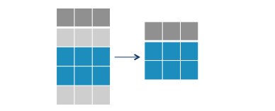
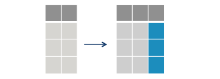

```{r setup, include=FALSE}
options(htmltools.dir.version = FALSE)
knitr::opts_chunk$set(message=FALSE, warning = FALSE, error = FALSE, cache = TRUE)

``` 


---

## Próximas Semanas

1. Manipulação de Bancos de Dados (dplyr)

2. Dados Tidy (tidyr)

3. Visualização (ggplot)


---

# Manipulação de Bancos de Dados

90% do nosso trabalho com dados consiste em colocar nossos dados no formato correto.. este processo envolve...

- manipular variáveis

- juntar bancos de dados

- reformatar dados

- limpeza... 

Para todas esta tarefas, usaremos os pacotes da família `tidyverse`

---

# Tidyverse

O `tidyverse` é uma família de pacotes em R desenvolvidos  de forma integrada e compartilhando uma mesma filosofia de design, gramática e estruturas de dados subjacentes.

O objetivo do `tidyverse` é prover um conjunto integrado de ferramentas para o uso do R como linguagem em Ciência de Dados. Estes são os principais pacotes do `tidyverse`:

- `dplyr`: para manipulação de dados.

- `ggplot2`: para visualização de dados.

- `tidyr`: para preparar seus dados para análise. 

- `purrr`: para otimizar seu código e para programação funcional.

- `readr`: para abrir e organizar os dados. 

- `stringr`: para manipulação de objetos de texto. 

- `forcats`: para manipulação da classe fatores. 

---
# Vantagens do Tidyverse ... em gif

.center[

```{r echo=FALSE, out.width="60%"}
knitr::include_graphics("https://media.giphy.com/media/elUGwgiPOdq7e/giphy.gif")
```

]

---

# Vantagens do Tidyverse ... em palavras.

- O `tidyverse` facilita substancialmente as tarefas de análise de dados quando comparado com códigos do  R básico. 

- Aumenta substancialmente quão legível seu código parece.

- Manipulação, visualização e modelagem estão integradas no tidyverse. 

- É amplamente utilizado na comunidade de R. Portanto, provavelmente você precisa aprender para ler códigos de outros colegas.


---
class:middle, center

# Introdução ao Tidyverse

---
## Instalação

```{r eval=FALSE}

install.packages("tidyverse")

```

```{r}
library(tidyverse)
```


---

## Tibbles. 


O objeto fundamental do `tidyverse` são bancos de dados.

O `tidyverse` usa objetos da classe "tibbles" para definir seus bancos de dados ao invés do tradicional data.frame que aprendemos semana passada. 

Tibbles são exatamente iguais aos data.frames em sua estrutura básica.  No entanto, tibbles possuem alguns ajustes - mais visuais -  para facilitar seu uso. 

---

## Criando Tibbles. 

--
.pull-left[
```{r}

# Classe do Banco de Dados mtcars
class(mtcars)

# Converte para tibbles
mtcars_tib <- as_tibble(mtcars)
mtcars_tib
```
]

--

.pull-right[
```{r}
tibble(a=c("Tiago", "Ventura"), 
       b=c("nome", "sobrenome"))
```

]

--

---

## Pipe.

.pull-left[
```{r echo=FALSE, out.width="60%"}
knitr::include_graphics("figs/pipe.jpg")
```
]

.pull-right[

O uso de pipes `%>%` é uma peça fundamental no funcionamento dos pacotes do `tidyverse`. As principais vantagens do pipe:

- Concatenar as funções do seu código. 

- Evitar objetos intermediários.

- Tornar os códigos mais intuitivos. 

- Evita múltiplos parentesis. 
]
---

### O R funciona de dentro para fora:

```{r}
# R
x <- c(1:10)
round(exp(sqrt(mean(x))), 1)

```

### O Pipe

```{r}
x %>%
  mean() %>%
  sqrt() %>%
  exp() %>%
  round(1) 
```

---
# Notas importantes sobre os pipes. 

**1. Os pipes sempre devem ser usados para conectar funções e seus outputs.**

```{r eval=FALSE}

# Não rode este código.
x %>%
  funcao1(arg1=x) %>%
  funcao2(arg=output_da_funcao1)
```

**Exemplo:**

```{r out.width="30%"}
sample(1:1000, 500, replace=TRUE) %>%
  density() %>% # funcao 1.
  plot() # função 2. 
```

---

**2. O input sempre pode ser omitido, ou representados pelo atalho `.`**

```{r}
sample(1:1000, 500, replace=TRUE) %>%
  density(.) %>% # funcao 1.
  plot(.) # função 2. 
```

---

**3. Os resultados do pipe não são salvos imediatamente. Você precisa atribuir à um novo objeto.** 

```{r}
grafico <- sample(1:1000, 500, replace=TRUE) %>%
              density(.) %>% # funcao 1.
              plot(.) # função 2. 
```

---

## Desafio. 

Reescreva o código abaixo utilizando o `%>%`.

```{r}
library(tidyverse)

x <- "cpdoc"
x <- str_to_upper(x)
x <- str_c(x, "-FGV")
x <- str_to_title(x)
x
```

```{r echo=FALSE}
library(countdown)
countdown(minutes = 3, seconds = 0, bottom = 0,
          right = 0,
          padding = "10px",
          margin = "5%",
          font_size = "3em")

```

--
```{r}
library(tidyverse)

x  %>%
  str_to_upper() %>%
  str_c("-FGV") %>%
  str_to_title()
```
--

---
class: middle, center, inverse

# Manipulação de dados com `dplyr`.

---

## Dados dos parlamentares 


```{r}
library(tidyverse)

pres_rio <- get_votes(year = 2018, 
                         position = "Presidente", 
                         regional_aggregation = "Municipio", 
                         state="RJ") %>%
                  as_tibble()
```

---

## Introdução ao Dplyr. 

O `dplyr` é um dos pacotes mais populares em R. 

Sua lógica é simples: suas funções fazem exatamente o que seus nomes descrevem (**verb based language**).  Estas são as funções mais úteis do `dplyr`:

.pull-left[
- `select()`: selecionar colunas.

- `filter()`: filtrar o banco de dados por linhas.

- `mutate()`: criar novas variáveis e alterar existentes.

- `arrange()`: ordenar o banco de dados.

- `group_by()`: agrupar e fazer análiser nos subgrupos. 

- `summarize()`: sumariza os dados por subgroups. 
]

.pull-right[


Todas essas funções seguem as mesmas características:

- O input é sempre um banco de dados. 

- O banco de dados é sempre o primeiro argumento. 

- Os argumentos seguintes acessão colunas dos bancos de dados diretamente, sem aspas. 

- O output é sempre um novo banco de dados. 

]

---

**Algumas outras funções menos utilizadas**:

- `count()`: contar número de observações por subgrupos.

- `distinct()`: eliminar repetições.

- `n():` conta quantas observações há em dados agrupados.

- `sample_n():` Selecion n amostras do seu banco de dadosl

- `glimpse():` Fornece um sumário dos seus dados. 

- `top_n():` Seleciona por linhas de acordo com o rank das variáveis.

- `slice()`: filtra seu banco de dados por posições. 

---

# Select: Seleciona Colunas. 


```{r echo=FALSE, out.width="80%"}
knitr::include_graphics("figs/select.png")
```

---
## Uso Básico

```{r}

pres_rio %>% # Dados
  select(ANO_ELEICAO, SIGLA_UE, NOME_MUNICIPIO, COD_MUN_IBGE) # colunas
```

---

## Reordenando Colunas

```{r}
pres_rio %>% # Dados
  # seleciona colunas
  select(QTDE_VOTOS, ANO_ELEICAO, SIGLA_UE, 
         NOME_MUNICIPIO, COD_MUN_IBGE) # colunas
```

---

## Renomeando Colunas

```{r}
pres_rio %>% 
  # seleciona colunas com novos nomes. 
  select(votos=QTDE_VOTOS, 
         ano=ANO_ELEICAO, 
         pais=SIGLA_UE, 
         mun=NOME_MUNICIPIO, 
         cod=COD_MUN_IBGE) # colunas
```

---

## Salvando Novo Banco. 

```{r}
rio_reduzido <- pres_rio %>% # Dados
                  # seleciona colunas com novos nomes. 
                  select(votos=QTDE_VOTOS, 
                         ano=ANO_ELEICAO, 
                         pais=SIGLA_UE, 
                         mun=NOME_MUNICIPIO, 
                         cod=COD_MUN_IBGE) # colunas
```

---

## Atalhos para Uso do Select. 

- `contains()` - Extrai colunas que contêm determinado texto.

- `starts_with()` - Extrai colunas que inicia com determinado texto.

- `ends_with()` - Extrai colunas que termina com determinado texto. 

- `everything()` - Extrai todas as colunas restantes.

---

## Exemplos

```{r}
pres_rio %>%
  # seleciona colunas onde NOME aparece
  select(contains("NOME"))
```


```{r}
pres_rio %>%
  # seleciona colunas que terminam com UF e 
  # todas as outras colunas restantes
  select(ends_with("UF"), everything())
```

---

## Filter: Filtra Linhas por Condições Lógicas. 


      filter(data, coluna=="a")


```{r echo=FALSE, out.width="80%"}

```

---

## Filter: Uso Básico


```{r}
pres_rio %>%
  # filtra casos ondem partido igual a 17.
  filter(NUMERO_CANDIDATO==17) %>%
  # seleciona
  select(DESCRICAO_CARGO, NUMERO_CANDIDATO, QTDE_VOTOS, NOME_MUNICIPIO)
```

---

## Filter: Multiplas Condições

```{r}
pres_rio %>%
  # filtra usando or
  filter(NUMERO_CANDIDATO==17 | NUMERO_CANDIDATO==13, # or
  #filtra usando and
         NOME_MUNICIPIO=="Rio de Janeiro") %>% # and
  #selecion
  select(DESCRICAO_CARGO, NUMERO_CANDIDATO, QTDE_VOTOS, NOME_MUNICIPIO)
```

---

## Arrange: Ordena Linhas por Colunas.

    arrange(data, coluna)

```{r echo=FALSE, out.width="80%"}
knitr::include_graphics("figs/arrange.png")
```

---

## Arrange: Uso Básico:
  
```{r}
pres_rio %>%
  # filtra pelas linhas
  filter(NUMERO_CANDIDATO==13) %>% 
  # seleciona
  select(DESCRICAO_CARGO, NUMERO_CANDIDATO,
         QTDE_VOTOS, NOME_MUNICIPIO) %>%
  # ordena de forma crescente
  arrange(QTDE_VOTOS)
```

---


## Arrange: Decrescente    


```{r}
pres_rio %>%
  # filtra pelas linhas
  filter(NUMERO_CANDIDATO==13) %>% 
  # seleciona variáveis
  select(DESCRICAO_CARGO, NUMERO_CANDIDATO, 
         QTDE_VOTOS, NOME_MUNICIPIO) %>%
  # ordena em valores descrecentes
  arrange(desc(QTDE_VOTOS))
```

---

## Mutate: Adiciona uma nova coluna. 

    mutate(data, nome_nova_coluna=valores_nova_coluna)

```{r echo=FALSE,out.width="80%"}

```

---

### Mutate: Uso Básico:

```{r}
pres_rio %>%
  # cria variável com estado e cidade
  mutate(estado_cidade=paste(NOME_MUNICIPIO, "-", NOME_UF)) %>%
  #seleciona para visualizar
  select(NOME_MUNICIPIO, NOME_UF, estado_cidade)
```

---

### Mutate: Condicionais

```{r}
pres_rio %>%
  # cria variável usando condicionais
  mutate(estado_sigla=ifelse(NOME_UF=="Rio de Janeiro", "RJ", NA), 
  # concatena nova variável com cidade
         estado_cidade=paste(estado_sigla, "-", NOME_MUNICIPIO)) %>%
  #selectiona
  select(NOME_UF, NOME_MUNICIPIO, estado_sigla, everything())
```

---

### Mutate: Operações Matemáticas. 

```{r}
pres_rio %>%
  # log dos votos
  mutate(log_votos=log(QTDE_VOTOS)) %>%
  # seleciona
  select(QTDE_VOTOS, log_votos)
```

---

## Group_by + Summarize. 

```{r echo=FALSE, out.width="60%"}
knitr::include_graphics("figs/group_by.png")
```

---

### Group_by

O primeiro passo é agrupar de acordo com a variável de nosso interesse. Não altera o banco em nada, visível. 

```{r}
pres_rio %>%
  # agrupando por candidato presidencial: 
  group_by(NUMERO_CANDIDATO) 
```

---

## Summarize.

```{r echo=FALSE, out.width="60%"}
knitr::include_graphics("figs/summarize.png")
```

---

## Summarize: Uso básico.


```{r}
pres_rio %>%
  # Somente primeiro turno 
  filter(NUM_TURNO==1) %>%
  # agrupando por candidato presidencial
  group_by(NUMERO_CANDIDATO) %>%
  # Somando os votos em todo o estado.
  summarise(voto_estado=sum(QTDE_VOTOS)) %>%
  # Ordena
  arrange(desc(voto_estado))


```

---

class:center, middle, alert

### o summarize transforma múltiplas linhas em uma para cada subgrupo

---

### Mais Exemplos

**Quem ganhou no Rio de Janeiro no Segundo Turno?**

```{r}
pres_rio %>%
  # Somente primeiro turno 
  filter(NUM_TURNO==2) %>%
  # agrupando por candidato presidencial
  group_by(NUMERO_CANDIDATO) %>%
  # Somando os votos em todo o estado.
  summarise(voto_estado=sum(QTDE_VOTOS)) %>%
  # Ordena
  arrange(desc(voto_estado))
```
---

**Total de Votos por Município**

```{r}
pres_rio %>%
  # Somente primeiro turno 
  filter(NUM_TURNO==1) %>%
  # agrupando por candidato presidencial
  group_by(NOME_MUNICIPIO) %>%
  # Somando os votos em todo o estado.
  summarise(voto_mun=sum(QTDE_VOTOS)) 
```

---

**Votos por Meso-Região**

```{r}
pres_rio %>%
  # Somente primeiro turno 
  filter(NUM_TURNO==1) %>%
  # agrupando por candidato presidencial
  group_by(NUMERO_CANDIDATO, NOME_MESO) %>%
  # soma de votos por município
  summarise(voto_media=mean(QTDE_VOTOS), 
            voto_min=min(QTDE_VOTOS), 
            voto_max=max(QTDE_VOTOS))
  
```

---

## Desafio

### Mutate x Summarize. 

```{r}

pres_rio %>%
  # Somente primeiro turno 
  filter(NUM_TURNO==1) %>%
  # agrupando por candidato presidencial
  group_by(NUMERO_CANDIDATO) %>%
  # Nova variável somando os votos em todo o estado.
  mutate(voto_estado=sum(QTDE_VOTOS))


```

---

### Praticando: 

Abra o banco de dados de candidatos a deputado federal no Rio de Janeiro. 

```{r}
dep_rio <- get_candidates(year=2018,
                          position="Federal Deputy") %>%
           as_tibble()
```


1 - Qual partido elegeu mais deputados? (3 linhas)

```{r}
# Dica: `data %>% filter(COD_SIT_TOT_TURNO==2 | COD_SIT_TOT_TURNO==3) =  filtra somente os eleitos. 

```

2 - Qual candidato gastou mais recursos ? (2-3 linhas)


3 - Qual valor médio declarado de gastos de campanha de acordo com o gênero dos candidatos? (3 linhas)

```{r echo=FALSE}
library(countdown)
countdown(minutes = 15, seconds = 0, bottom = 0,
          right = 0,
          padding = "10px",
          margin = "5%",
          font_size = "3em")

```


---

# Conectando Bancos de Dados com Dplyr. 

Raramente, você encontrará um banco de dados onde todas as informações da sua pesquisa estão contidas e prontas para serem analisadas.  


Na maioria dos casos, e por boas razões, bancos de dados possuem informações distintas, e os pesquisadores precisam conectá-los com vistas a construir o material necessário para suas análises. 

Este tipo de dados conectados a partir de várias tabelas são chamados de **dados relacionais**.  

---

## Chaves (keys)

São as variáveis capazes de conectar bancos de dados.  Estas **chaves** são, ou devem ser:

- Completas. Nunca tenha missing values nas suas chaves. 

- Únicas: cada observação deve possuir uma chave distinta. Evite sempre duplicações. 


---
class: middle, center, inverse

## Joins

---

Inspirado na linguaguem **SQL**, o dplyr possui um conjunto de funções com foco em conectar bancos de dados distintos. 

Vamos criar dois bancos bem simples para entendermos como estes joins funcionam. 

```{r}
data1 <- tibble(nome=c("A", "B", "C"), 
                value=c(10, 20, 30)) 
data2 <- tibble(nome=c("A", "D", "C"), 
                value2=c(10, 50, 30))
data1
data2
```

---

### left_join()

.pull-left[
```{r echo=FALSE,out.width="80%"}
knitr::include_graphics("figs/left-join.gif")
```
]

.pull-right[

```{r}
left_join(data1, data2)
```

]
---

### inner_join()

.pull-left[
```{r echo=FALSE,out.width="80%"}
knitr::include_graphics("figs/inner-join.gif")
```
]

.pull-right[
```{r}
inner_join(data1, data2)

```
]

---

## full_join()

.pull-left[
```{r echo=FALSE,out.width="80%"}
knitr::include_graphics("figs/full-join.gif")
```
]

.pull-right[
```{r}
full_join(data1, data2)

```
]

---

### Chaves Distintas?

```{r}
data3 <- data2 %>%
          # alterando o nome
          select(chave=nome, everything())

# Join

left_join(data1, data3, 
          by=c("nome"="chave")) # adicione argumento by.

```

---

### Desafio

Abre os bancos de dados de candidatos e votos do TSE. Faça um join entre eles, e salve o banco de dados.

- Quantas linhas este novo banco de dados possuí?

- Explique o número de linhas. 

```{r}
# Banco Candidatos
candidatos <- get_candidates(year=2018, position="President") %>% 
                as_tibble()

# Banco Votos
votos <- get_votes(year = 2018, position="President", state="RJ") %>%
            as_tibble()
# Join? 
```

```{r echo=FALSE}
library(countdown)
countdown(minutes = 10, seconds = 0, bottom = 0,
          right = 0,
          padding = "10px",
          margin = "5%",
          font_size = "3em")

```

---


## Concatenando Bancos de Dados

Além de juntar bancos de dados usando chaves, podemos concatecar bancos verticalmente (pelas linhas) ou horizontalmente (pelas colunas). 

---

### bind_rows: por linhas

```{r}
bind_rows(data1, data2)
```

Note: ao conectar por linha, **as colunas precisam ter os mesmos nomes**. Caso não, você adicionará uma nova variável ao resultado final. 

---

### bind_cols: por colunas

```{r}
bind_cols(data1, data2)
```

Note: ao conectar por coluna, **as linhas precisam ter tamanho igual**.

---

class: middle, center, inverse

## [Exercicio 3]()


